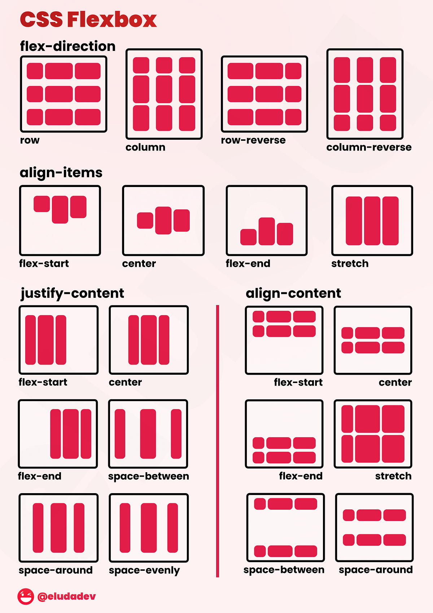

##  HTML Entities — special characters

```html
&copy;    →  ©   (copyright)
&amp;     →  &   (ampersand)
&nbsp;    →     (non-breaking space)
&lt;      →  <   (less than)
&gt;      →  >   (greater than)
&#8377;   →  ₹   (rupee sign)
&mdash;   →  —   (em dash)
```

## Box model — every element is a box
```css
┌─────────────────────────────┐
│           MARGIN            │  space outside the border
│   ┌─────────────────────┐   │
│   │       BORDER        │   │  the visible border line
│   │   ┌─────────────┐   │   │
│   │   │   PADDING   │   │   │  space inside the border
│   │   │  ┌───────┐  │   │   │
│   │   │  │CONTENT│  │   │   │  the actual text/image
│   │   │  └───────┘  │   │   │
│   │   └─────────────┘   │   │
│   └─────────────────────┘   │
└─────────────────────────────┘
```




### The core idea — change layout at breakpoints

- Desktop  (> 900px)  →  2 column grid,  full navbar
- Tablet   (< 768px)  →  1 column,       smaller text
- Mobile   (< 480px)  →  stacked,        hamburger menu